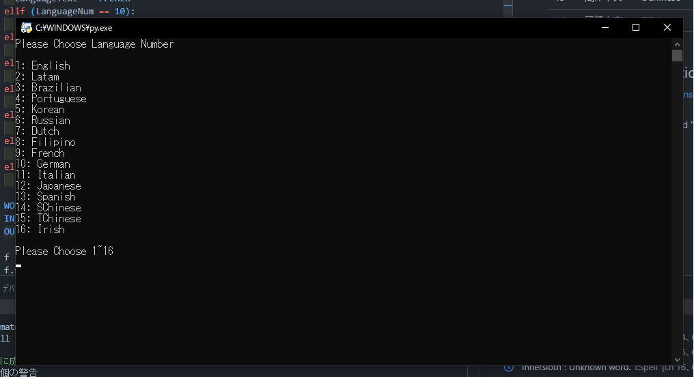

 

 

#

This mod is not affiliated with Among Us or Innersloth LLC,
 and the content contained therein is not endorsed or otherwise sponsored by Innersloth LLC.
 Portions of the materials contained herein are property of Innersloth LLC. © Innersloth LLC.

 

#
 
 

# We need more **Translator**!
If you can cooperate with translation activities, 
Mention me on my dedicated Discord channel. 
 

## Translation Status
✅ All Completed! 
🟨 We already have a translator. In progress. 
🛑 Not Completed. We need Translator.
|No.|Language||Status|
|---|--------|-------|------|
|0|English||✅|
|1|Español|Latam|🛑|
|2|Português|Brazilian|🛑|
|3|Português|Portuguese|🛑|
|4|한국어|Korean|🛑|
|5|Русский|Russian|🛑|
|6|Nederland|Dutch|🛑|
|7|Bisaya|Filipino|🛑|
|8|Français|French|🛑|
|9|Deutsch|German|🛑|
|10|Italiano|Italian|🛑|
|11|日本語|Japan|✅|
|12|Español|Spanish|🛑|
|13|简体中文|SChinese|🟨|
|14|繁體中文|TChinese|🛑|
|15|Gaeilge|Irish|🛑|

## How to make Translation File?
1. Write translate data in [TranslateFile](https://github.com/Dekokiyo/UltimateMods/blob/main/Translate.xlsx) file.
2. Download [Converter](https://github.com/Dekokiyo/UltimateMods/blob/main/Dev/Converter.py).
3. Set the "Translate.xlsx" and "Converter.py" in the same directory and start
the "Converter.py".
4. Choose Language Number

5. Start Convert.
6. When finished, a file will be generated, so put it in the Language folder and it will be applied.